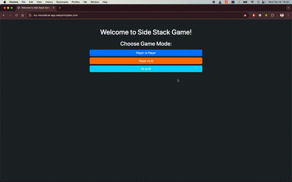
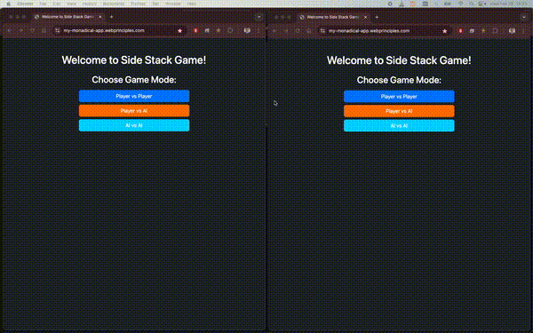

# Mon****** - A Super Fun Application

## Overview
**Mon******** is a web-based game built using FastAPI, JavaScript, HTML, CSS, and jQuery. It offers multiple game modes, including **Player vs Player, Player vs AI, and AI vs Player**, powered by Q-learning for AI decision-making. The game is hosted on **AWS EC2** with an **Apache server** and **SQLite database**, ensuring smooth performance and scalability.

## Demo GIFs

### AI vs AI
<p align="left">
  
</p>

### Player vs AI
<p align="left">
  
</p>

### Player vs Player
<p align="left">
  
</p>

## Features
- **Three Game Modes**:
  - Player vs Player
  - Player vs AI
  - AI vs Player
- **Real-time Gameplay** (using long polling instead of sockets for now)
- **Intelligent AI** powered by Q-learning
- **Web-hosted Application** ([Visit the Game Here](https://my-mon-app.webprinciples.com/))
- **Secure & Scalable Hosting** (AWS EC2 with Apache and SQLite)
- **Git & Gitignore Configured** for seamless local and server syncing

## Technology Stack
- **Backend**: FastAPI, Apache Server
- **Frontend**: JavaScript, HTML, CSS, jQuery
- **Database**: SQLite (Designed but not actively used for game storage)
- **Hosting**: AWS EC2 with a subdomain and SSL certificate
- **AI Model**: Q-learning for game decision-making

## Known Issues & Limitations
- **Latency in Real-Time Gameplay**: Uses long polling instead of WebSockets, resulting in slightly higher latency.
- **Limited Multiplayer Support**: Currently, only **two players** can play simultaneously. Expanding to multiple players is planned for future updates.
- **Basic Messaging System**: The messaging feature in the front end requires a proper function for structured messages.

## Future Enhancements
- Implement **WebSockets** for improved real-time communication.
- Expand multiplayer support beyond **two players**.
- Improve **front-end messaging system** for a better user experience.
- Enhance AI strategies for a more challenging gameplay experience.
- Integrate **user authentication and leaderboards** for tracking performance.

## Installation & Usage
This project is hosted online, and no local installation is required.
To play, simply visit: **[https://my-mon-app.webprinciples.com/](https://my-mon-app.webprinciples.com/)**

## Project Structure

```plaintext
.
├── ai_logic.py          # Q-learning algorithm for AI decision-making
├── database/           # Contains the SQLite database
│   ├── game_data.db    # SQLite database file (not actively used)
├── models.py           # Database design schema
├── q_table.pkl         # Machine learning trained data (Q-learning)
├── requirements.txt    # List of frozen Python package dependencies
├── server.py           # Main FastAPI application server
├── static/             # Contains all static files (CSS, JS, images, etc.)
├── .env/               # Virtual environment directory (not included in repo)
```

## Screenshots & GIFs
(*Include GIFs or Screenshots Here*)

---
For any inquiries or feedback, feel free to open an issue on this repository. 🚀
